<h1> Documentação Jogo RPG - Projeto Futuro no Presente </h1>

<h3>Alan Ribeiro da Silva e Victor Lombardi da Rocha </h3>

<h2>Informações Gerais: </h2>

<p>-Título do Jogo: Kirl´s Gate </p>

<p>-Plataforma: Web (PC) e Mobile (Android e Apple) </p>

<p>-Público Alvo: Adolescentes/Jovens (12 / 16) </p>

<p>-Classificação Indicativa: 10 anos </p>

<p>-Gênero: Plataforma, Ação e Aventura, RPG em turno e Estratégia </p>

<p>-Conceito: É um jogo de RPG em turnos, no qual você terá que escolher maneiras e formas de lidar com o seu inimigo se aproveitando de suas fraquezas e usufruindo ao máximo de suas qualidades de suas classes e itens. </p>

 

<p>-Título: Kirl´s é o vilão principal do jogo, é ele que te dará as opções dos finais alternativos do RPG. Gate é portão em inglês e essa será a figura de passagem para a boss figth contra ele. </p>

<p>-Plataforma: Nós utilizaremos o html como base dos códigos por isso o jogo terá como principal plataforma o sistema web, tanto PC quanto Mobile. </p>

<p>-Público Alvo:  O público alvo será adolescentes e jovens, pois é um jogo RPG que trará conceitos que são explorados por pessoas dessa faixa etária. </p>

 

<h2>História do Jogo:  </h2>

-Resumo: A história do jogo se baseia em um rei que rege um reino chamado Carxo e faz um seguinte decreto: “Quem me trouxer o grande Santo Graal, o maior segredo 
do mundo, localizado nas mais profundas cavernas do submundo, para este lhe entregarei a Cixar, a espada mais forte entre céu e terra... e mais 100.000 créditos”. 

Então o personagem vai atrás do seu objetivo em busca do Santo Graal, passando pelos lugares mais inóspitos e perigosos 
[Documentação Jogo RPG História - Argumento.docx](https://github.com/V1ct0rR0ch4976/Kirls-Gate-RPG-Game/files/11507790/Documentacao.Jogo.RPG.Historia.-.Argumento.docx)

<h3>Histórias Secundárias:</h3>
<h3>As Bestas Míticas</h3>
Antes, Corxa era uma ilha sem vida, até que as 3 Bestas Míticas chegaram, cada uma em um tempo, e cada uma delas protegia uma parte da terra, Krakos, o polvo de 1000 tentáculos, prtotegia o mar; Uthrul, o Dragão mais forte, protegia os céus, e Amin, a Toupeira com o maior conhecimento de todos, protegia a terra. Por conta de se setirem seguros graças as Bestas, várias espécies começaram a chegar. Porém, um dia, Amin descobriu um poder avassalador, o poder da persuasão, preso dentro de um livro, e ao abri-lo, Amin se corrompeu. Para impedi-lo de fazer o mal, Uthrul e Krakos o prenderam dentro de um minério, e o batizaram de Amin, e há lendas que quem chegar perto desse minério pode acabr se perdendo para persuasão do minério. Com ninguém para proteger a terra, Uthrul se tornou Ganancioso, e tomou todas as terras e cavernas para si, usando da força para conquista-las.

<h2>Protagonista:</h2>
<h5>Historia:</h5> Ele era de uma pequena vila, Dodrio, porém, um dia, a vila dele foi atacada pelo mítico dragão Uthrul, e desde então vem treinando para derrotar o dragão em batalha, mas nunca teve o poder suficiente para derrota-lo
<p> Mago: 80 vida 140 mana 80 stamina </p>
<p> Cavaleiro: 130 vida 60 mana 110 stamina 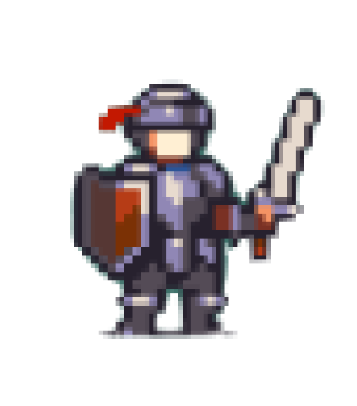</p>
<p>Arqueiro: 90 vida 90 mana 120 stamina 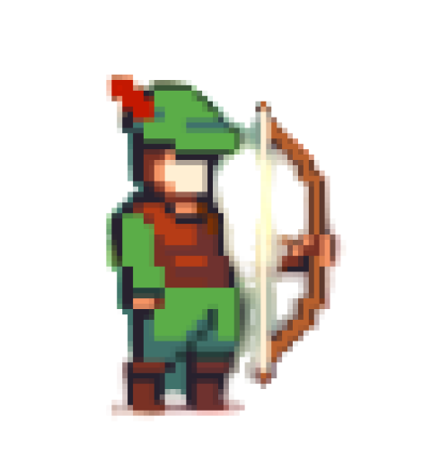</p>

<h2>Inimigos Comuns:</h2> 

<h3>Slimes:</h3>
<h5>Descrição:</h5>
São pequenas geleias, que embora fofas, podem ser bem maldosas... Cada tamanho tem uma força diferente, e sua cor determina sua personalidade: vermelho/irritado, amarelo/animado, marrom/cansado, laranja/assustado, azul/triste, verde/enjoado, entre outros... Parecem ter sido originadasde um lugar bem longe daqui, quem sabe, nas estrelas.
<h5>Local de aparição:</h5> Floresta Sussurrante
<h5>Força:</h5> 1/10 (Slime menor) 2/10 (Slime médio) 3/10 (Slime grande)
<h5>Vida:</h5> 60 vida
<h5>Ataques:</h5>
 <p>Investida – Ataca o player com uma investida básico causando dano físico //// <strong>40 de dano: FÍSICO</strong></p>
 <p>Encobrir – Se protege com uma camada a mais de geleia, levando menos dano na rodada e danificando o player se atingido. //// <strong>+ 10 Defesa, 20 de dano (se atingido): FÍSICO</strong></p>
<h5>Sprites:</h5>


<h3>Esqueletos:</h3>
<h5>Descrição:</h5>
Quando alguém é assassinado no reino de Corxa, seu espírito fica preso em seu esqueleto pela eternidade, até que derrote alguém em combate, enquanto isso, essas almas perdidas vagam o submundo eternamente em busca de sua liberdade.
<h5>Local de aparição:</h5>
Caverna da Ira, Submundo
<h5>Força:</h5> 2.5/10 (Caverna) 5/10 (Submundo)
<h5>Vida:</h5> 100 vida
<h5>Ataques:</h5>
 <p>Corte – Ataca o player com uma espada causando dano físico //// <strong>45 de dano: FÍSICO</strong></p>
 <p>Lubrificar – Ele lubrifica seus ossos, aumentando sua defesa e aumentando seu ataque //// <strong>+ 10 Defesa + 10 ataque</strong></p>
<h5>Sprites:</h5>


<h3>Aranhas:</h3>
<h5>Descrição:</h5>
Esses aracnídeos letais nunca estão sozinhos, eles sempre estão em grandes grupos de outras aranhas, e são resultados de anos de evolução para se adaptar a esse mundo perigoso que é Corxa.
<h5>Local de aparição:</h5>
Ninho das Aranhas
<h5>Força:</h5> 3/10
<h5>Vida:</h5> 100 vida
<h5>Ataques:</h5>
 <p>Picada – Ataca o player com suas presas, causando dano físico e tem 10% de chance de envenenar o player, fazendo-o levar dano passivo por 3 rodadas //// <strong>10 de dano (Veneno), 50 de dano: FÍSICO</strong></p>
 <p>Seda de teia – Ataca o player, prendendo-o em teia, e incapacitando-o por 1 rodada, mas tem somente 50% de chance de acertar</p>
<h5>Sprites:</h5>
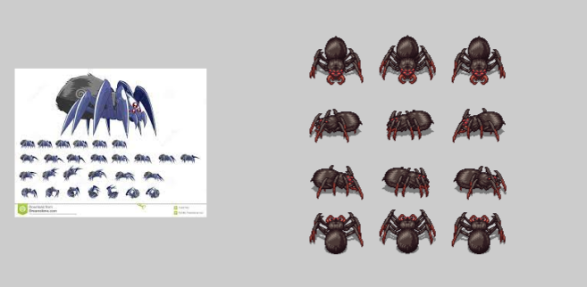

<h3>Agua-Morta(Dead-fish):</h3>
<h5>Descrição:</h5>
Esses seres são descendentes das famosas águas-vivas, porém depois de tanto tempo nas cavernas, esses seres perderam seus espíritos, então vagam pelas cavernas em busca de viajantes que estão passando para roubar seus espíritos para si, mas após um tempo eles acabam voltando por seu espírito ter morrido novamente.
<h5>Local de aparição:</h5>
O Reino Aquático 
<h5>Força:</h5> 4/10
<h5>Vida:</h5> 160 vida
<h5>Ataques:</h5>
 <p>Eletrificar – Ataca o player ao tocar com ele, causando dano físico e tem 10% de chance de eletrificar o player, imobilizando-o por 1 rodada //// <strong>40 de dano: FÍSICO/ÁGUA</strong></p>
 <p>Presa de Tentáculos – Ataca o player, prendendo-o em seus tentáculos, e incapacitando-o por 1 rodada, mas ele perde 10% de sua vida</p>
<h5>Sprites:</h5>
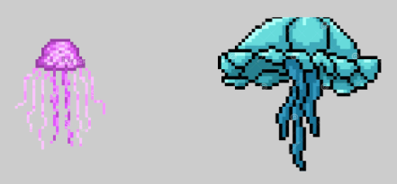

<h3>Anões:</h3>
<h5>Descrição:</h5>
Esses incríveis guerreiros já foram os reis de toda a terra de Carxo, e eram famosos por sua fome por mineração, porém um dia eles acharam um minério diabólico chamado Amin, que consumia a alma de quem ficava perto dele por muito tempo, porém eles ficaram fascinados pelo minério, e então acaberam se perdendo para o minério, e começãram a atacar todos que chegavam perto do minério, até seus companheiros, e isso gerou uma guerra entre os anões, onde, após a grande batalha dos Anões, esse grupo de anões foram exilados e forçados a viver de baixo da terra, porém eles não aceitaram isso facilmente, e, por milênios, vem treinando, se alimentando do ódio do Amin para retomar a superfície. Os outros anões que continuaram na superfície se tornaram os humanos que hoje estão nas cidades de Carxo.
<h5>Local de aparição:</h5>
O Reino Secreto dos Anões
<h5>Força:</h5> 6/10
<h5>Vida:</h5> 200 vida
<h5>Ataques:</h5>
 <p>Minerar – Ataca o player usando sua Picareta, causando dano físico //// <strong>70 de dano: FÍSICO</strong></p>
 <p>Ira do Anão – Ataca o player com um ataque poderoso, causando dano mágico, porém ele perde 50% da sua vida no processo //// <strong>150 de dano: MÁGICO</strong></p>
<h5>Sprites:</h5>


<h3>Sepentes de fogo:</h3>
<h5>Descrição:</h5>
Essas serpentes são reencarnações de dragões que morrem, como esqueletos para humanos, e elas vagam o submundo e seus arredores para poder achar sua liberdade, e essas serpentes chegam a 120 graus Celsius.
<h5>Local de aparição:</h5>
As Cavernas Flamejantes
<h5>Força:</h5> 7/10
<h5>Vida:</h5> 250 vida
<h5>Ataques:</h5>
 <p>Incinerar – Ataca o player com uma rajada de fogo, causando dano mágico e elemental do tipo fogo //// <strong>70 de dano: FÍSICO/FOGO</strong></p>
 <p>Enforcar – Prende o player em seu corpo e dá dano físico, mas tomará 1.5x de dano na próxima rodada //// <strong>85 de dano: FÍSICO</strong></p>
<h5>Sprites:</h5>


<h3>Mago negro (Dark Mage):</h3>
<h5>Descrição:</h5>
São poderosíssimos feiticeiros que ao morrer foram ao submundo, porém, por conta de sua enorme força, foram escolhidos pelo Rei do Submundo para serem seus soldados mais confiáveis. Seus poderes foram ampliados pelo Santo Graal.
<h5>Local de aparição:</h5>
Submundo
<h5>Força:</h5> 8/10
<h5>Vida:</h5> 350 vida
<h5>Ataques:</h5>
 <p>Incinerar – Ataca o player com uma rajada de fogo, causando dano mágico e elemental do tipo fogo, e tambem tem 10% de chance de queimar o oponente //// <strong>100 de dano: MÁGICO/FOGO</strong></p>
 <p>Afogar – Ataca o player com uma onda forte de água, causando dano mágico e elemental do tipo água //// <strong>100 de dano: MÁGICO/ÁGUA</strong></p>
 <p>Destruição – Ataca o player com uma rajada de Meteoros, causando dano mágico e elemental do tipo fogo, mas ele não pode se mover na próxima rodada //// <strong>150 de dano: MÁGICO/FOGO</strong></p>
 <p>Sangue-Suga – Ataca o player com um feitiço que rouba a mana do player e recupera a vida dele, ele não pode usar esse movimento 2 vezes seguidas //// <strong>- 20 mana, recupera 50 de vida</strong></p>
<h5>Sprites:</h5>
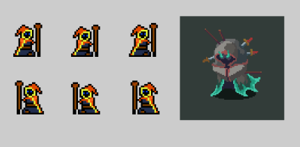

<h2>Chefões:</h2>

<h3>Slime Ogro:</h3>
<h5>Descrição:</h5>
Este é o slime mais forte da floresta, ele já foi antes um slime normal, porém descobriu que poderia ficar maior e mais forte ao consumir outros slimes, assim matou muitos slimes, e se tornou um slime gigante.
<h5>Local de aparição:</h5>
Florestas Sussurrante
<h5>Força:</h5> 6/10
<h5>Vida:</h5> 500 vida
<h5>Defesa:</h5> 0 defesa
<h5>Ataques:</h5>
 <p>Investida pesada – Ataca o player com uma investida básica, causando dano físico//// <strong>60 de dano: FÍSICO</strong></p>
 <p>Duplicar – O slime se duplica e causa 2 ataques separados, com 60% de cada um atingir, causando dano físico//// <strong>40 de dano (cada): FÍSICO</strong></p>
 <p>Encobrir – Se protege com uma camada a mais de geleia, levando menos dano na rodada e danificando o player se atingido. //// <strong>+ 10 Defesa, 40 de dano   (se atingido): FÍSICO</strong></p>
<h5>Sprites:</h5>


<h3>Rainha Aranha:</h3>
<h5>Descrição:</h5>
Essa aranha teve seu ninho inteiro destruído por Uthrul, e desde então vem crescendo seu ódio e sua força vem aumentando para enfrentar o Dragão, e ela criou um exército de aranhas no seu comando para tal.
<h5>Local de aparição:</h5>
Ninho das Aranhas
<h5>Força:</h5> 6.5/10
<h5>Vida:</h5> 600 vida
<h5>Defesa:</h5> 10 defesa
<h5>Ataques:</h5>
 <p>Picada Profunda– Ataca o player com suas presas, causando dano físico e tem 15% de chance de envenenar o player, fazendo-o levar dano passivo por 3 rodadas //// <strong>10 de dano (Veneno), 80 de dano: FÍSICO</strong></p>
 <p>Seda de teia – Ataca o player, prendendo-o em teia, e incapacitando-o por 1 rodada, mas tem somente 50% de chance de acertar</p>
 <p>Tóxico – Ataca o player, envenenando-o-o com usas presas, mas tem somente 50% de chance de acertar //// <strong>10 de dano (Veneno)</p>
<h5>Sprites:</h5>


<h3>Kraken:</h3>
<h5>Descrição:</h5>
Esse ser mítico é uma besta descedente de uma das 3 Grande Bestas: Uthrul, Krakos, Amin. Por ser descedente de Krakos, é uma besta poderosíssima, e seu trabalho é proteger os mares e cavernas aquáticas de viajantes com má intenções. Como ele faz isso? Batalhando, óbviamnete. Se ele sentir que seu adversário é um oponente formidável, ele o deixará passar.
<h5>Local de aparição:</h5>
O Reino Aquático
<h5>Força:</h5> 7/10
<h5>Vida:</h5> 2000 vida (Batalha acaba no 600)
<h5>Defesa:</h5> 20 defesa
<h5>Ataques:</h5>
 <p>Tentáculos Venenosos – Ataca o player com seus tentáculos, causando dano físico e tem 10% de chance de envenenar o player, fazendo-o levar dano passivo por 3 rodadas //// <strong>10 de dano (Veneno), 100 de dano: FÍSICO</strong></p>
 <p>Ataqe de tentáculos – Ataca o player, prendendo-o em teia, e incapacitando-o por 1 rodada, mas tem somente 50% de chance de acertar</p>
 <p>Cachoeira Violenta – Ataca o player com uma rajada de água, causando dano mágico //// <strong>110 de dano: MÁGICO</strong></p>
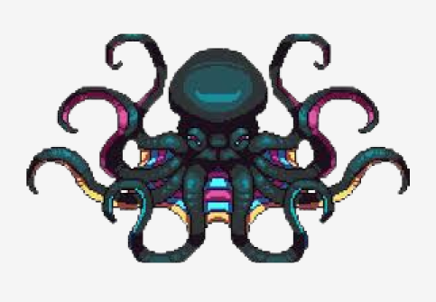

<h3>Rei Anão:</h3>
<h5>Descrição:</h5>
O rei da tribo dos anões presos debaixo da terra. Ele já se perdeu completamnete por conta do ódio do minério.
<h5>Local de aparição:</h5>
Ninho das Aranhas
<h5>Local de aparição:</h5>
O Reino Secreto dos Anões
<h5>Força:</h5> 7/10
<h5>Vida:</h5> 400 vida
<h5>Defesa:</h5> 30 defesa
<h5>Ataques:</h5>
 <p>Minerar – Ataca o player usando sua Picareta, causando dano físico //// <strong>100 de dano: FÍSICO</strong></p>
 <p>Ira do Anão – Ataca o player com um ataque poderoso, causando dano mágico, porém ele perde 50% da sua vida no processo //// <strong>250 de dano: MÁGICO</strong></p>
 <p>Enlouquecer – Ganha 50% a mais em todos os atributos</p>
<h5>Sprites:</h5>
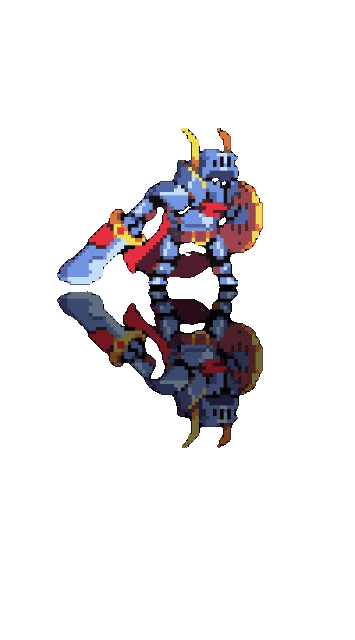

<h3>Golem de Amin:</h3>
<h5>Descrição:</h5>
A manifestação da vontade do minério. A maldade em si. Nunca foi visto por ningém, até agora...
<h5>Local de aparição:</h5>
Ninho das Aranhas
<h5>Local de aparição:</h5>
O Reino Secreto dos Anões
<h5>Força:</h5> 7/10
<h5>Defesa:</h5> 50 defesa
<h5>Vida:</h5> 400 vida
<h5>Ataques:</h5>
 <p>Esmagar – Ataca o player batendo seus punhos no chão, causando dano físico //// <strong>100 de dano: FÍSICO</strong></p>
 <p>Flecha de Amin – Ataca o player com uma flecha feita de Amin, causando dano mágico //// <strong>80 de dano: MÁGICO</strong></p>
 <p>Autodestruição – Da um dano muito alto, mas perde 90% da vida no processo //// <strong>300 de dano: MÁGICO</strong></p>
<h5>Sprites:</h5>


<h3>Serpente Morta:</h3>
<h5>Descrição:</h5>
É uma serpente que é o espírito do primeiro dragão morto, mas essa alma não aceitou sua morte e tentou voltar a superfície, e como punição sua alma foi morta, e assim esse corpo tomou conta, e para conter sua vontade de querer ter uma alma, ele consome as almas de quem está passando, seja um esqueleto, uma serpente, ou um viajante...
<h5>Local de aparição:</h5>
As Cavernas Flamejantes
<h5>Força:</h5> 9/10
<h5>Vida:</h5> 700 vida
<h5>Defesa:</h5> 30 defesa
<h5>Ataques:</h5>
 <p>Esmagar – Ataca o player batendo agarrando-o, causando dano físico //// <strong>120 de dano: FÍSICO</strong></p>
 <p>Desintegrar – Ataca o player com uma rajada de lava, causando dano mágico do tipo elemental fogo, que sempre deixará queimado e dará dano por 3 rodadas //// <strong>10 de dano (Se queimado),120 de dano: MÁGICO/FOGO</strong></p>
  <p>Troca de pele – Aumenta a defesa e o ataque //// <strong>+ 30 defesa, + 30 ataque</strong></p>


<h3>Rei do Submundo (Kirl):</h3>
<h5>Descrição:</h5>
O Rei do Submundo, ele parece ser mais do que parece...
<h5>Local de aparição:</h5>
Submundo
<h5>Força:</h5> 10/10
<h5>Vida:</h5> 1000 vida
<h5>Defesa:</h5> 30 defesa
<h5>Ataques:</h5>
 <p>Cortes Rápidos – Ataca o player o cortando com sua espada, causando dano físico //// <strong>160 de dano: FÍSICO</strong></p>
 <p>Desintegrar – Ataca o player com uma rajada de lava, causando dano mágico do tipo elemental fogo, que sempre deixará queimado e dará dano por 3 rodadas //// <strong>10 de dano (Se queimado),180 de dano: MÁGICO/FOGO</strong></p>
 <p>Poder do Submundo – Recupera 100 de vida, mas ele só pode usar 3 vezes esse ataque</p>


<h3>Uthrul, O Dragão mais forte:</h3>
<h5>Descrição:</h5>
Uma das 3 Bestas Míticas. Foi ele quem trouxe segurança aos céus, mas agora ele se tornou ganancioso. Dizem que a força de suas escamas podem construir as mais lendárias das armas, mas são apenas suposições
<h5>Local de aparição:</h5>
Covil do Dragão
<h5>Força:</h5> 10/10
<h5>Vida:</h5> 2000 vida
<h5>Defesa:</h5> 40 defesa
<h5>Ataques:</h5>
 <p>Rajada de Fogo – Ataca o player com uma rajada de fogo, causando dano mágico, com 50% de chance de queimar o player //// <strong>200 de dano: FÍSICO</strong></p>
 <p>Ira do Dragão – Ele libera o poder de mil estrelas no player, jogando meteoros no chão, mas ele não pode usar esse ataque pelas próximas 5 rodadas //// <strong>300 de dano: MÁGICO/FOGO</strong>
 <p>Poder do Dragão – Recupera 100 de vida, mas ele só pode usar 3 vezes esse ataque</p>
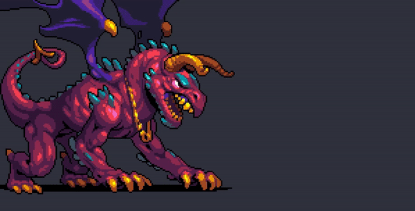

<h2>Mecânicas:</h2>

<h3>Vida:</h3>
	<p>A vida é a vitalidade que o player tem, e quando ela se exaure, o player perde</p>

<h3>Mana:</h3>
	<p>A mana é uma energia, que é usada para fazer ataques mágicos, e se ela se exaure ela não se regenera automaticamente, você tem que usar uma poção</p>

<h3>Stamina:</h3>
	<p>A stamina é uma energia, que é usada para fazer atques físicos e para poder correr e pular pelo mundo, e se ela se exaure em batalha, só pode ser regenerada por poção, mas se ela se exaure ela volta normalmente, sem precisar de nada</p>

<h3>Poções:</h3>
	<p>As poções são itens utilizáveis, e existem vários tipos:</p>
		<h6><strong>Gwellhad:</strong> Uma poção que recupera a vida. A normal cura 50 de vida, a avançada cura 80 de vida, e a de mestre cura toda a sua 		vida</h6>
		<h6><strong>Egni:</strong> Uma poção que recupera a Stamina. A normal cura 40 de stamina, a avançada cura 80 de stamina, e a de mestre cura toda a 		sua mana</h6>
		<h6><strong>Hud:</strong> Uma poção que recupera a mana. A normal cura 40 de mana, a avançada cura 60 de mana, e a de mestre cura toda a sua 			mana</h6>
		<h6><strong>Corfforol:</strong> Uma poção que Aumenta o ataque físico. A normal aumeneta 20 pontos, a aumenta cura 40 pontos, e a de mestre 		aumenta 60 pontos</h6>
		<h6><strong>DifrodHud:</strong> Uma poção que Aumenta o ataque mágico. A normal aumeneta 20 pontos, a aumenta cura 40 pontos, e a de mestre 		aumenta 60 pontos</h6>

<h3>Elementos:</h3>
	<p>Existem 3 tipos de elementos, e cada um pode ser atribuído tanto a um inimigo quanto a uma arma. Esses são os elementos e suas características:</p>
	<h6><strong>Fogo:</strong> Ele é 1.5x mais forte contra água, mas leva 1.5x a mais de dano de terra<h6>
	<h6><strong>Água:</strong> Ele é 1.5x mais forte contra terra, mas leva 1.5x a mais de dano de fogo<h6>
	<h6><strong>Terra:</strong> Ele é 1.5x mais forte contra fogo, mas leva 1.5x a mais de dano de água<h6>

<h3>Plataformas:</h3>
	<p>As plataformas aparecerão pela a sua aventura, para distanciar batalhas e quebrar um pouco da monotonia de somente batalhar. Existirão desafios de plataforma, e caso você consiga passar por eles você ganhará itens e recompensas.</p>
		
<h3>NPC'S:</h3>

```
<h4>Mercante de Poções</h4>
<p>O Mercante é um personagem animalesco que aparece no início da primeira fase, mas nas outras fases, ele aparece apenas no final. É um ser muito elétrico e está louco para adquirir mais mais moedas</p>
<p>Ele venderá algumas poções:
-Gwellhad;
-Egni;
-Hud;
-Corfforol;
-Difrodhud;</p>
```

		
```
<h4>Ferreiro</h4>
<p>É um típico ferreiro medieval. Pai de família e explorador, ele sempre fará armas forjadas ao troco dos itens e de algumas moedas</p>
<p>O ferreiro usará a <strong>Forja</strong> e ele aparecerá em algumas fases especifícas, sendo possível até mesmo forjar armas com drops dos boses</p>
```

		
```
<h4>Vendedor de Itens</h4>
<p>É um velho senhor que está no auge da sua aposentadoria. Ele já foi um explorador assim como o personagem principal, e ao longo da sua jornada ele coletou diversos itens e está atribuindo valor a esses itens e vendendo ao protagonista</p>
<p>Ele venderá anéis que teram efeitos passivos no jogar, como mais dano, mais armadura, mais crítico e etc. Esses itens passivos só podem ser adquiridos ao troco de moedas e o stats dos itens irão combar com os outros artefatos já adquiridos pelo jogador</p>
```


<h3>Forja:</h3>
		<p>Para acessar a forja você precisa falar com o ferreiro ao final de cada fase.</p>
		<p>Para  conseguir forjar algum item, é necessário lhe entregar 3 itens, caso os três itens possam tenham sinergia e possam ser combinados, ele gerará uma arma, armadura ou um artefato, ao troco dos 3 itens e uma certa quantia de dinheiro. Quanto mais você avança nas fases mais forte será os itens forjados e mais será para produzilos</p>

<h3>Batalha:</h3>
	Quando você chega perto de um inimigo, a batalha se inicia. Você tem 3 opções, pode: Atacar, Ir para inventário ou Bloquear, e em alguns casos, usar a Ultimate.
		
		<p>ATACAR: Se você escolher essa ação, você irá escolher um dos ataques que você tem, tem o ataque normal da classe, um ataque que não gasta nenhuma stamina ou mana, um ataque da arma que você está usando, e um ataque extra, que você pode encontrar em baús e em lojas para comprar.</p>
		<p>INVENTÁRIO: Se você escolher essa açao, você poderá acessar o seu inventário, onde você poderá usar itens que você coletou pela sua jornada</p>
		<p>BLOQUEAR: Quando você escolhe esta opção, você irá defender o ataque inimigo. O ataque será igual a: DANO - DEFESA. Então se você tem 30 de fesa e o dano do inimgo é 50, você receberá 20 de dano. Ao defender você ganha pontos de ultimate, que enchem o seu ataque especial</p>
		<p>ULTIMATE: Ao completar a barra de ultimate, você poderá usar um ataque especial, definido pela a sua arma em mão.</p>
		
		
<h3>Dano Cítico:</h3>
<p>Quando você ataca, existe 5% de chance de você dar 1.5x o dano que você daria. Ex: Você ia dar 100 de dano, mas conseguiu um dano crítico, agora você dará 150 de dano</p>
		
<h3>Guilda</h3>
<p> Você pode, com o acesso a guilda, que será uma pequena construção na vila inicial, jogar com seus amigos de diversos locais, tudo o que precisa é gastar 100 moedas e trá a taxa de entrada paga. Além de poder jogar com amigos, você pode encontrar missões, onde se aceita-las e completa-las, ganhará recompensas, como moedas, minérios e itens especiais</p>
		
<h3>Moedas:</h3>
	<p>Você ganhará moedas ao derrotar monstros e ao abrir baús, e você pode usar essas moedas para comprar poções, armamentos e itens passivos<p>

<h2>ITENS</h2>

<h3><strong>Armamento:</strong></h3>
<p>Esses armamentos são itens que você levará para batalhas, e eles determinarão seu ataque, defesa e defesa ao bloquear

<h3>Espadas:</h3>
	
<h4>Cixar</h4>
		
<p><strong>Descrição:</strong> Uma espada que foi criada nos primórdios da vida em Corxa, com o auxílio das Bestas Míticas, e esta espada é capaz de matar qulquer um, ou qualquer coisa, e dizem ser a espada mais poderosa do reino.</p>
		
<p><strong>Status:</strong></p>
		
```
ATAQUE: 180 de dano
ELEMENTO: Água
ULTIMATE: Ataque do herói: Desfere um grande ataque mágico no oponente, que tem 50% de chance de paralisa-lo //// 300 de dano: MÁGICO
EFEITO PASSIVO: Se combinado com o Escudo Paladino, dá + 30 de ataque
```
		
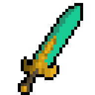
		
<h4>Espada de Presa de Aranha</h4>
		
<p><strong>Descrição:</strong> Uma espada que só pode ser feita a partir de um minério especial combinado com a presa de uma aranha poderosa. Dizem que essa arma tem vida própria, e que se não bem cuidada, pode vir a noite de "picar"</p>
		
<p><strong>Status:</strong></p>
		
```
ATAQUE: 130 de dano
ELEMENTO: Nenhum
ULTIMATE: Presa da aranha: Desfere um ataque poderoso no oponente, que o deixará incapaz de se mover por 2 rodadas e o envenenará //// 10 de dano (Veneno)
EFEITO PASSIVO: Da 1.25x de dano a mais contra aranhas
```
		

		
<h4>Lâmina da Seda Negra</h4>
		
<p><strong>Descrição:</strong> Uma espada forjada a partir da seda da roupa dos magos mais poderosos. Dizem que ela possue o poder mágico de um, mas que se muito utilizada, pode converter o usuário em um mago também. Mas novamente, somente boatos...</p>
		
<p><strong>Status:</strong></p>
		
```
ATAQUE: 120 de dano
ELEMENTO: FOGO
ULTIMATE: Seda misteriosa: Desfere um ataque poderoso no oponente, que sempre será do elemento mais forte contra o do oponente (Se não houver um o ataque será de fogo) //// 150 de dano: MÁGICO/???
EFEITO PASSIVO: Da 1.25x de dano a mais contra Magos Negros
```
		
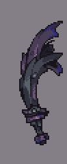
		
<h4>Espada de Cobre</h4>
		
<p><strong>Descrição:</strong> Uma espada simples, feita de cobre, dizem que, se enferrujada, ela poderá dar um ataque poderoso</p>
		
<p><strong>Status:</strong></p>
		
```
ATAQUE: 50 de dano
ELEMENTO: Nenhum
ULTIMATE: Corte rápido: O player realizará um atque rápido que causará bastante dano //// 80 de dano: FÍSICO
(Se enferrujada) ULTIMATE: Trovoada //// 150 de dano: MÁGICO
EFEITO PASSIVO: Nenhum
```
		
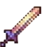
		
<h4>Espada Glacial</h4>
		
<p><strong>Descrição:</strong> Essa espada tem o poder guardado da era glacial da Terra. Ela foi formado pela alta pressão das geleiras e uma intensa condesação de água em forma sólida. Dizem que essa arma jamais se descogelará de novo. </p>
		
<p><strong>Status:</strong></p>
		
```
ATAQUE: 80 de dano
ELEMENTO: Nenhum
ULTIMATE: Nevasca Letal: Realiza uma tempestade que dará dano contínuo no inimigo e aumentará em 20% os ataques do elemento água //// 1 rodada -- 60 de dano, 2 e 3 rodadas -- 30 de dano: MÁGICO/ÁGUA
EFEITO PASSIVO: Se estiver combinado com uma armadura aquática dará 1.25X mais dano
```
		
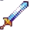
		
<h4>Lâmina de Tungstênio</h4>
		
<p><strong>Descrição:</strong> Este minério é um ferro um pouco mais poderoso que o ferro, e é realmente difícil de encontrar, somente encontrado em cavernas já bem exploradas, onde a rocha já foi bem escavada você pode encontra-los </p>
		
<p><strong>Status:</strong></p>
		
```
ATAQUE: 90 de dano
ELEMENTO: Terra
ULTIMATE: Corte rápido: O player realizará um atque rápido que causará bastante dano //// 140 de dano: FÍSICO 
EFEITO PASSIVO: Nenhum
```
		
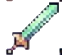
		
<h4>Espada de diamante</h4>
		
<p><strong>Descrição:</strong> Forjada a partir de vários diamantes combinados, se acredita que somente os ricos ou os mais exploradores podem ter acesso a essa arma, também é dito que a ideia da forja veio de um outro universo, onde tudo seria uma forma geométrica, mas é tudo baboseira.</p>
		
<p><strong>Status:</strong></p>
		
```
ATAQUE: 110 de dano
ELEMENTO: Nenhum
ULTIMATE: Feixe de luz: Desfere um feixe poderoso no oponente, que sempre paralisa o oponente e causa dano //// 150 de dano: MÁGICO
EFEITO PASSIVO: Da 1.5x de dano a mais se combinado com o Escudo Quadrado
```
		
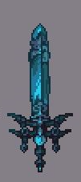
		
<h4>Sabre de Platina</h4>
		
<p><strong>Descrição:</strong> Esta é uma arma raríssima de se encontrar entre os viajantes, somente aqueles mais dedicados poderão ter acesso a essa arma. </p>
		
<p><strong>Status:</strong></p>
		
```
ATAQUE: 150 de dano
ELEMENTO: Terra
ULTIMATE: Tempestade de lâmina //// 200 de dano: FÍSICO 
EFEITO PASSIVO: Nenhum
```
		
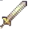
		
<h4>A Lâmina do Rei</h4>
		
<p><strong>Descrição:</strong> Esta lâmina pertencia a um antigo rei de Corxa, mas após muitas brigas para consegui-la, acabou se perdendo nas cavernas, mas quem sabe, um dia, alguém pode encontra-la...</p>
		
<p><strong>Status:</strong></p>
		
```
ATAQUE: 120 de dano
ELEMENTO: Fogo
ULTIMATE: A Força de um Rei: Impede o oponente de se mover por 2 rodadas
EFEITO PASSIVO: Dá 1.25 de dano a mais contra esqueletos
```
		

		
<h4>A Lâmina do Dragão</h4>
		
<p><strong>Descrição:</strong> Esta pode somente ser forjada com uma escama de dragão, e tem que ser forjada nas cavernas mais quentes da terra. Também é nescessário um minério maligno e a presa de uma aranha poderosa para completar a receita. Ninguém nunca empunhou essa arma, então o que será que ela faz? Bom, só tem um jeito de descobrir</p>
		
<p><strong>Status:</strong></p>
		
```
ATAQUE: 200 de dano
ELEMENTO: Fogo
ULTIMATE: Ira do Dragão: Lança uma poderosa rajada de fogo no inimgo, queimando-o //// 20 de dano (Se queimado), 350 de dano: MÁGICO/FOGO
EFEITO PASSIVO: Da 1.25x de dano a mais contra serpentes
```
		

		
<h4>Lâmina Carmesim</h4>
		
<p><strong>Descrição:</strong> Essa espada foi forjada com o sangue de 100 soldados, e ela foi considerada uma espada proibida, por usar, em vez de mana ou stamina, usa da sua vitalidade para atacar.</p>
		
<p><strong>Status:</strong></p>
		
```
ATAQUE: 250 de dano // 80 de dano em si (Se está com sangue) -- 80 de dano (Se está sem sangue)
ELEMENTO: Fogo
ULTIMATE: Perfuração de sange: SEMPRE matará o inimigo (exceto chefões), mas deixará o player com 10 de vida //// 500 de dano (Sem contar a armadura) => Somente se é um chefão
EFEITO PASSIVO: Nenhum
```
		
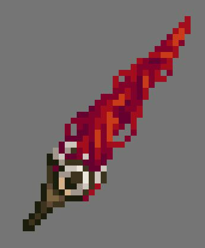

<h4>Espada de madeira</h4>
		
<p><strong>Descrição:</strong> A primeira espada de qualquer cavaleiro, e é essencial para qualquer início de jornada</p>
		
<p><strong>Status:</strong></p>
		
```
ATAQUE: 30 de dano
ELEMENTO: Terra
ULTIMATE: Corte rápido: O player realizará um ataque rápido que causará bastante dano //// 60 de dano
EFEITO PASSIVO: Nenhum
```
		
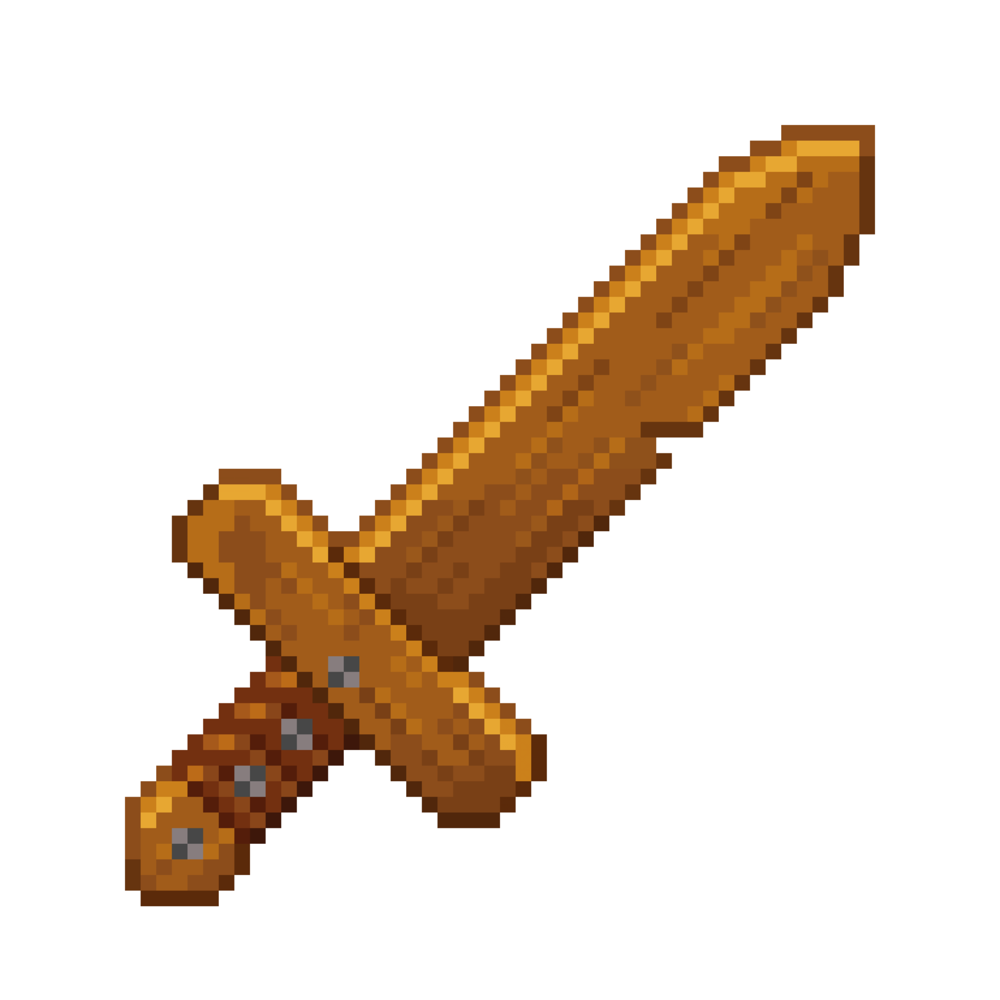

<h4>Espada de ferro</h4>
		
<p><strong>Descrição:</strong> É uma espada bem simples, é feita de ferro</p>
		
<p><strong>Status:</strong></p>
		
```
ATAQUE: 70 de dano
ELEMENTO: Nenhum
ULTIMATE: Corte rápido: O player realizará um ataque rápido que causará bastante dano //// 100 de dano
EFEITO PASSIVO: Nenhum
```
		
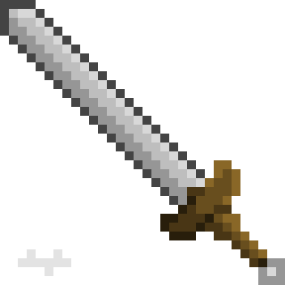
		
<h3>Escudos:</h3>
		
<h4>Escudo paladino</h4>
		
<p><strong>Descrição:</strong> Este escudo pertenceu a um grande herói, que acredita ser o primeiro pprtador da Cixar, e este escudo é feito de um dos mais fortes minérios</p>
		
<p><strong>Status:</strong></p>
		
```
DEFESA: 60 de defesa
ELEMENTO: Água
EFEITO PASSIVO: Se combinado com a Cixar, dará + 20 de defesa
```
		

		
<h4>Escudo de Amin</h4>
		
<p><strong>Descrição:</strong> Este escudo é feito de um minério maligno, mas tem um poderoso poder defensivo</p>
		
<p><strong>Status:</strong></p>
		
```
DEFESA: 50 de defesa
ELEMENTO: Terra
EFEITO PASSIVO: Aumentará + 10 de defesa para cada item que tiver Amin em posse do jogador
```
		
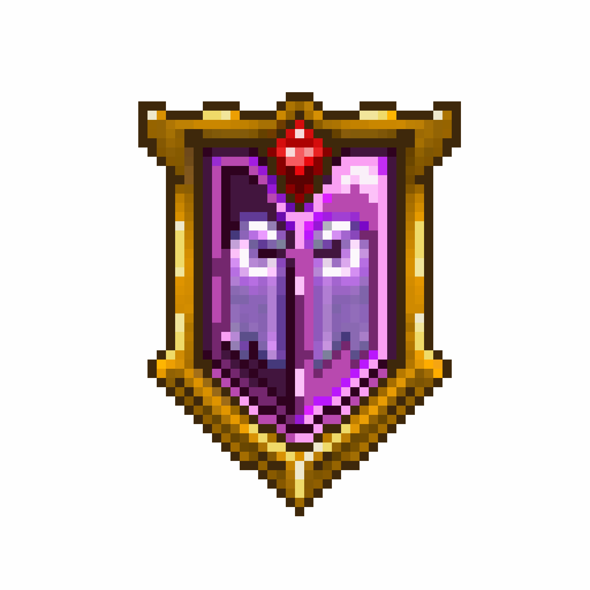
		
<h4>Escudo de cavaleiro</h4>
		
<p><strong>Descrição:</strong> Pertenceu a um grande cavaleiro de uma terra distante, quem sabe um dia de para ir até ela...</p>
		
<p><strong>Status:</strong></p>
		
```
DEFESA: 40 de defesa
ELEMENTO: Nenhum
EFEITO PASSIVO: Nenhum
```
		
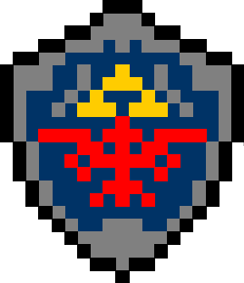
		
<h4>Escudo Carioca</h4>
		
<p><strong>Descrição:</strong> Um escudo muito bonito, e que já ganhou o mundial, diferente de um outro escudo verde ...</p>
		
<p><strong>Status:</strong></p>
		
```
DEFESA: 100 de defesa
ELEMENTO: Nenhum
EFEITO PASSIVO: Ganha todos os jogos de futebol
```
		
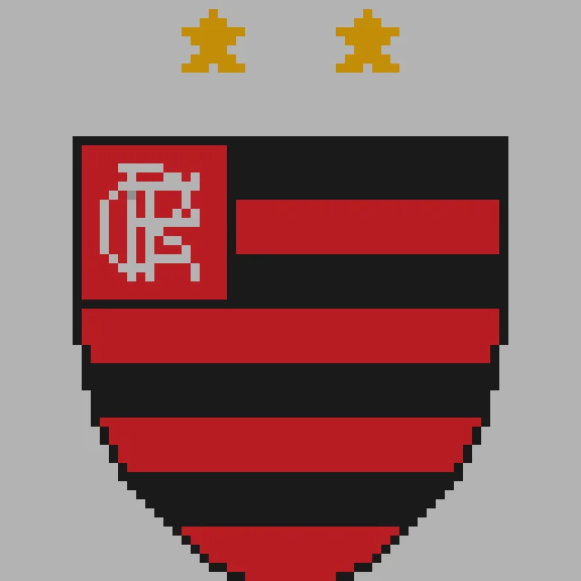
		
<h4>Escudo de Madeira</h4>
		
<p><strong>Descrição:</strong> Um escudo básico, feito de madeira, nada de mais</p>
		
<p><strong>Status:</strong></p>
		
```
DEFESA: 10 de defesa
ELEMENTO: Nenhum
EFEITO PASSIVO: Nenhum
```
		
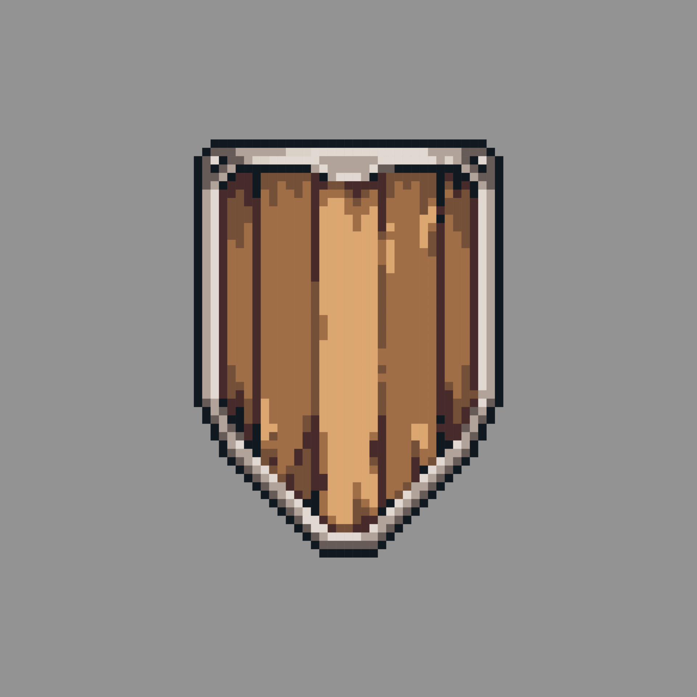

<h4>Escudo do cavaleiro negro</h4>
		
<p><strong>Descrição:</strong> Um escudo de um lugra bem longe, esbanja a maldade</p>
		
<p><strong>Status:</strong></p>
		
```
DEFESA: 35 de defesa
ELEMENTO: Nenhum
EFEITO PASSIVO: Nenhum
```
		

		
<h4>Escudo de Ouro</h4>
		
<p><strong>Descrição:</strong> Este escudo pertencia a antigos burgueses, e conforme o tempo foi passando absorveram a energia que a moeda traz, e quando estão longe delas se enfraquecem, e quando tem muitas moedas ao seu redor ele fica mais poderoso.</p>
		
<p><strong>Status:</strong></p>
		
```
DEFESA: 10 de defesa
ELEMENTO: Nenhum
EFEITO PASSIVO: Para cada 100 moedas que você tiver adicionará + 10 de defesa
```
		
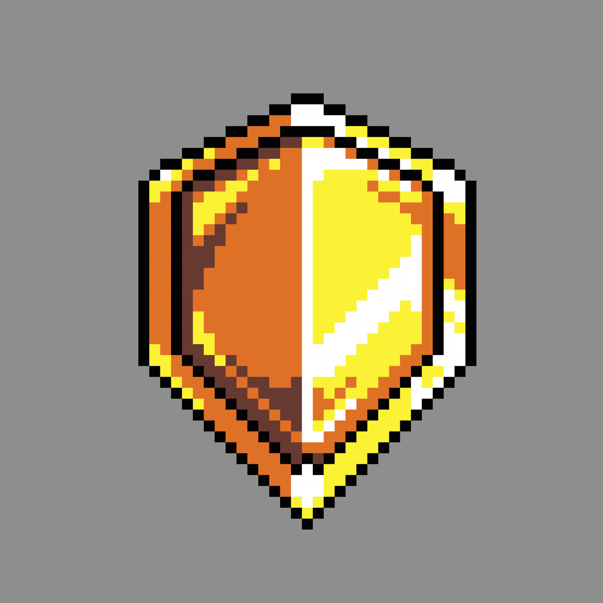
		
<h4>Escudo Quadrado</h4>
		
<p><strong>Descrição:</strong> Este escudo é dito ser de outra dimensão, mas isso é pura besteira, embora seja estranho sua estranha "Quadradice"</p>
		
<p><strong>Status:</strong></p>
		
```
DEFESA: 30 de defesa
ELEMENTO: Nenhum
EFEITO PASSIVO: Se estiver combinado com a Espada de Diamante ele terá + 20 de defesa
```
		
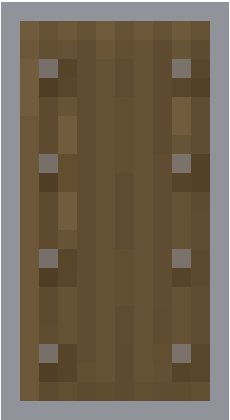
		
<h4>Broquel Dracônico</h4>
		
<p><strong>Descrição:</strong> Este escudo é feito de escamas de dragão, e consegue absorver altas temperaturas</p>
		
<p><strong>Status:</strong></p>
		
```
DEFESA: 60 de defesa
ELEMENTO: Nenhum
EFEITO PASSIVO: - 20% de dano de Fogo
```
		
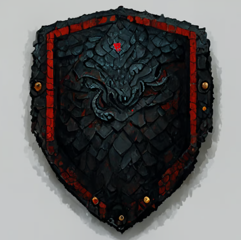
		
<h4>Escudo Real</h4>
		
<p><strong>Descrição:</strong> É um escudo para a realeza, e apenas os mais fortes podem usa-lo corretamente</p>
		
<p><strong>Status:</strong></p>
		
```
DEFESA: 35 de defesa
ELEMENTO: Nenhum
EFEITO PASSIVO: Nenhum
```
		

		
		
<h3>Armadura:</h3>
		
<h4>Armadura de madeira</h4>
		
<p><strong>Descrição:</strong> Esta é a armadura mais básica para qualquer viajante, mas com certeza a mais essencial para o começo de uma nova jornada</p>
		
<p><strong>Status:</strong></p>
		
```
DEFESA: 20 de defesa
ELEMENTO: Terra
EFEITO PASSIVO: Nenhum
```
		
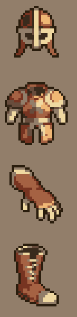
		
<h4>Armadura de ferro</h4>
		
<p><strong>Descrição:</strong> Esta armadura á feita de ferro. Muitos a consideram fraca, mas existem aqueles que a consideram um marco... </p>
		
<p><strong>Status:</strong></p>
		
```
DEFESA: 30 de defesa
ELEMENTO: Nenhum
EFEITO PASSIVO: Nenhum
```
		
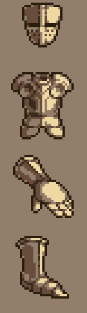
		
<h4>Armadura de Ouro</h4>
		
<p><strong>Descrição:</strong> Essa é uma armadura feita para os ricos e nobres, e dizem que se combinados com outros itens de ouro pode se tornar poderosíssima </p>
		
<p><strong>Status:</strong></p>
		
```
DEFESA: 20 de defesa
ELEMENTO: Nenhum
EFEITO PASSIVO: Se combinada com o escudo de ouro / cajado de ouro / arco de ouro terá + 30 de defesa
```
		
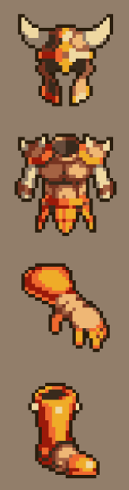
		
<h4>Armadura de Tungstênio</h4>
		
<p><strong>Descrição:</strong> Esta sim é uma armadura que foi muito utilizada, mas desde que o minério de diamante foi achado ela tem caído em desuso. Se armaduras tivessem sentimentos, essa com certeza seria trite</p>
		
<p><strong>Status:</strong></p>
		
```
DEFESA: 40 de defesa
ELEMENTO: Terra
EFEITO PASSIVO: Se combinada com a espada de diamante, terá - 10 de defesa
```
		
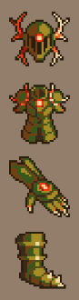
		
<h4>Armadura de Diamante</h4>
		
<p><strong>Descrição:</strong> Uma armadura raríssima, mesmo entre os mais experientes aventureiros. Esta armadura esbanja uma luz tão forte que pode iluminar cavernas</p>
		
<p><strong>Status:</strong></p>
		
```
DEFESA: 50 de defesa
ELEMENTO: Terra
EFEITO PASSIVO: Se combinada com o Escudo Quadrado dará + 10 de defesa
```
		
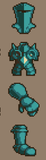
		
<h4>Armadura de Platina</h4>
		
<p><strong>Descrição:</strong> Esta é a armadura mais rara para um aventureiro. Esta armadura é extremamente durável, e com certeza servirá de grande uso. Dizem que sua composição é forte contra dragões, mas ninguém nunca voltou vivo para confirmar a históra</p>
		
<p><strong>Status:</strong></p>
		
```
DEFESA: 60 de defesa
ELEMENTO: Nenhum
EFEITO PASSIVO: Se o inimigo for um dragão você terá + 10 de defesa
```
		
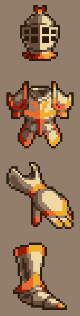
		
<h4>Armadura Real</h4>
		
<p><strong>Descrição:</strong> Uma armadura pertencente a realeza. É dito que uma vez colocada, somente alguém de puro coração poderá retirá-la... ou quem já matou um slime</p>
		
<p><strong>Status:</strong></p>
		
```
DEFESA: 45 de defesa
ELEMENTO: Nenhum
EFEITO PASSIVO: Se combinada com alguma peça real terá + 10 de defesa
```
		

		
<h4>Armadura Dracônica</h4>
		
<p><strong>Descrição:</strong> As escamas de um dragão morto é dito ser a segunda coisa mais resistente que existe no reino de Corxa, além de ter uma excelente resistência a altas temperaturas</p>
		
<p><strong>Status:</strong></p>
		
```
DEFESA: 70 de defesa
ELEMENTO: Nenhum
EFEITO PASSIVO: + 10 de defesa contra FOGO
```
		
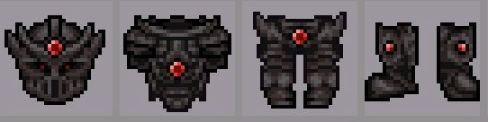
		
<h4>Armadura Dracônica</h4>
		
<p><strong>Descrição:</strong> Essa armadura só foi usada por uma pessoa, o Rei anão, que achou que ela esbanjava poder e fartura. Quando descobriu a verdade, a destruiu, porém já era tarde demais</p>
		
<p><strong>Status:</strong></p>
		
```
DEFESA: 80 de defesa
ELEMENTO: Nenhum
EFEITO PASSIVO: Nenhum
```
		
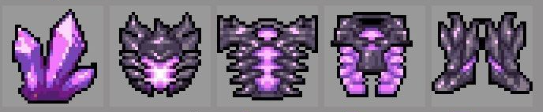

<h3>Arcos:</h3>

<h4>Arco de Madeira</h4>
		
<p><strong>Descrição: É um simples arco de madeira. Utilizado por arqueiros e caçadores inexperientes, também são muito utilizados para campos de teste ou treinamento.</strong> </p>
		
<p><strong>Status:</strong></p>
		
```
ATAQUE: 50 de dano Físico
ELEMENTO: 
ULTIMATE: Tiro certeiro: Embora seja de madeira, ainda sim ele pode ser bem forte se utilizado na maneira certa. A flevha sai em rápida direção a cabeça do alvo causando-lhe muito dano. //// 65 de dano FÍSICO / 10% de crítico
```
		

		
<h4>Arvoredo Silencioso</h4>
		
<p><strong>Descrição: Este arco é comumente usado por caçadores locais, por ser extremamente rápido e silencioso. Ele é construído por povos nativos sendo utilizado apenas materiais naturais, como vinhas e ossos de animais. Ele é feito para matar o alvo em um acerto</strong> </p>
		
<p><strong>Status:</strong></p>
		
```
ATAQUE: 60
ELEMENTO: TERRA
ULTIMATE: Presa Morta: o portador analisa a sua presa, vendo os pontos fracos, então ele perde uma rodada, para que o seu próximo ataque seja em um ponto vital, dando assim, muito dano. //// 100 de dano TERRA / 20% de chance de crítico / crítico 1.75x
```
		

		
<h4>Arco Mercante</h4>
		
<p><strong>Descrição: Arco de ouro vendido pelo mercador. Foi forjado para a elite de atiradores de Corxa. No reino de Kurl, apenas os melhores se utilizam desse arco.</strong> </p>
		
<p><strong>Status:</strong></p>
		
```
ATAQUE: 75
ELEMENTO: 
ULTIMATE: Golpe de Elite: O arco reluz em ouro, brilhando a ponto de cegar animais próximos. O brilho passa pelo arco todo, inclusive transformando flecha empunhada no mais puro ouro. Embora se torne bem pesado, o tiro ainda sim passa rajante pela vento e perfura a pele do alvo lhe causando muito dano físico. //// 135 de dano FÍSICO / 15% de crítico / caso seja dano crítico, o alvo dropa 1.75x moedas
```
		

		
<h4>Ossos de Caça</h4>
		
<p><strong>Descrição: Dropado pelo esqueletos, esse arco não só é extremamente raro, como também esconde um poder oculto. O esqueleto que forjou o arco está preso nele agora pelo eterno sempre. Mas ele ainda pode se comunicar com o mundo externo e para liberar seu total poder é necessário entregar almas para seu forjador. </strong> </p>
		
<p><strong>Status:</strong></p>
		
```
ATAQUE: 70
ELEMENTO: 
ULTIMATE: Tiro sedento: O forjador começa a gritar pelo arco, escorrendo um liquido preto, indo até a ponta da flecha. Quando disparada no alvo e perfurada a sua pela, ele passa a sugar a entropia do alvo, retirando-lhe uma porcentagem de sua vida. //// 110 de dano Físico / 15% da vida do alvo
EFEITO: A cada 20 almas aumenta 10 de dano (máximo 100 almas)
```
		

		
<h4>Arco Crivado</h4>
		
<p><strong>Descrição: Esse arco encontrado nos ninhos das aranhas, já foi usado por um antigo caçador. Ele tem um livro próprio na capital de Carxo. Até hoje se acredita que foi o melhor Arqueiro a pisar nessas terras. É um arco feito de platina e coberto com folhas de ouro, além de pequenas pedras de esmeralda cravejadas no arco.</strong> </p>
		
<p><strong>Status:</strong></p>
		
```
ATAQUE: 110
ELEMENTO: 
ULTIMATE: As joias esmeraldinas começam a reluzir e brilhar, chamando a alma do antigo portador desse arco. A flecha passa a ficar translúcida e brilhar, se tornando a única flecha espectral encontrada em todo mundo de Carxo. //// 160 de dano Físico / ignora armadura dos alvos/ 25% de crítico 1.80x
```
		

		
<h4>Coleira de Kraken</h4>
		
<p><strong>Descrição: É uma armada obtida após matar o próprio kraken. Este arpão lnada mais é que um artefato construído e pensado unicamente para matar o ser mítico. Mas, com o passar dos anos esse item foi perdido nos altos mares de Corxa, sendo assim, escondido pelo lorde dos Mares.</strong> </p>
		
<p><strong>Status:</strong></p>
		
```
ATAQUE: 120 dano FÍSICO
ELEMENTO: ÁGUA
ULTIMATE: Ímpeto de Kraken: A munição do arpão se torna mais afiada, surgindo dentes do próprio kraken, perfurando o inimigo e rasgando seu seus tecidos corporais, podendo assim causar severos danos. //// 200 de dano de ÁGUA / quebra a armadura do alvo e qualquer dano causado novamente ao alvo que sofreu o "Ímpeto de Kraken" tem +25% de chance de dar crítico (1.5x) 
EFEITO PASSIVO: Nenhum
```
		
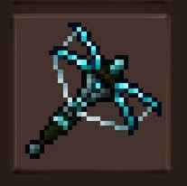
		
<h4>Arbalete de Amin</h4>
		
<p><strong>Descrição: </strong>  Esta arma foi utilizada por séculos pelos anões, porém, com a descoberta de suas malignas intenções,  caiu em desuso. É dito que, quando usado, pode acabar corrompendo a alma do usuario</p>
		
<p><strong>Status:</strong></p>
		
```
ATAQUE:150 de dano
DEFESA: 50 de defesa
ELEMENTO: Terra
ULTIMATE: Proteção de amin: As joias de amin se reluzem e maximizam o seu poder, criando um resistente escudo em volta do player. //// Cria uma especie de escudo em volta do player. Esse escudo tem 300 de defesa e dura por 3 rodadas
EFEITO PASSIVO: Nenhum
```
		

		
<h4>Arco de Carmin</h4>
		
<p><strong>Descrição: Arco proveniente da mais pura carnificina. Este arco é sendento por sangue, acabando com a vivência de qualquer ser apara alcançar isso, não importando as medidas para isso...</strong> </p>
		
<p><strong>Status:</strong></p>
		
```
ATAQUE: 100 de dano Físico
ELEMENTO: 
ULTIMATE: Carnificina: O arco está louco por chacina e lançará flechas guiadas para todos os alvos adjacentes do portador, fazendo sangrar até satisfazer a obstinação do arco. //// 200 de dano Físico / TODOS recebem sangramento (50 por rodada e a cada rodada aumenta mais 25 de dano) / o próximo primeiro ataque do portador tem 40% de crítico e 2.25x
EFEITO PASSIVO: Nenhum
```
		

		
<h4>Cólera do Inferno</h4>
		
<p><strong>Descrição: Arco feito da pressurização do mais puro e quente fogo já visto. Esse arco é capaz de fundir metais, sendo até a serpente afetada pela fervura de seu fogo.</strong> </p>
		
<p><strong>Status:</strong></p>
		
```
ATAQUE: 130
ELEMENTO: FOGO
ULTIMATE: Abrasar Arma: O arco passa se tornar extremamente quente a ponto de causar dano até mesmo no portador. Toda a ira do inferno é concentrada no ultimo pontoda flecha e vaporizará qualquer outra substância que o toque. //// 210 de dano de FOGO / causa 30 de dano no portador, mas lhe oferece uma defesa passiva de 20 de defesa (efeito passivo para) / o próximo primeiro ataque do portador tem 35% de crítico e 2.25x
EFEITO PASSIVO: Causa 5 de dano no portador por rodada
```
		

		
<h4>Caçador de Dragões</h4>
		
<p><strong>Descrição: Arma forjável após matar o monstro mítico Uthrul, o "Caçador de Dragões" é a o arco mais forte já visto por toda a elite do reino de Kurl. Dissecando o mítico montro e entregar os materiais ao ferreiro, você conseguirá o este artefato místico capaz de abalar qualquer sistema nevoso com uma só felchada. Sua base feita de ossos de dragão, recoberto por uma fina camada de escamas draconianas e costuradas com sangue draconiano, você se tornará a lenda do arqueiro mais forte já visto no mundo.</strong> </p>
		
<p><strong>Status:</strong></p>
		
```
ATAQUE: 150
ELEMENTO: FOGO
ULTIMATE: Exterminar: O portador é tomado pelo poder de Uthrul e passsa a atirar várias flechas em direção ao alvo, todas elas, flamejantes, prontas para vaporizar qualquer coisa que estiver em sua frente. //// 250 de dano FÍSICO / Deixa o alvo queimando (50 por rodada) / Deixa o alvo vulnerável ao próximo golpe, 50% de crítico 2.75x
EFEITO PASSIVO: As flechas passam a dar o dano elemental imbuidas nelas
```
		


<h3>Cajados:</h3>
		
<h4>Cajado de Madeira</h4>
		
<p><strong>Descrição: Feito para magos iniciantes, o cajado de madeira é utilizado por aprendizes que utiliza a concentração de uma pérola rubi para atacar os inimigos</strong> </p>
		
<p><strong>Status:</strong></p>
		
```
ATAQUE: 50 de dano
DEFESA: 10
ELEMENTO: 
ULTIMATE: Pérola Mágica Vermelha: O cajado usufrui de boa parte da energia do usuario para concentrar em uma ataque que irá causar grande dano mágico no inimigo //// 70 de dano: Mágico
```
		
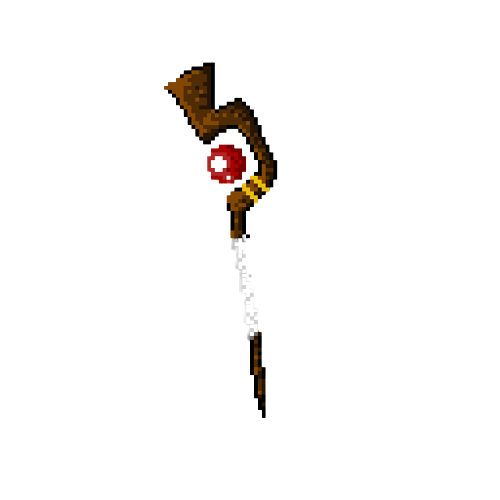
		
<h4>Cajado de Vinha</h4>
		
<p><strong>Descrição: Esse cajado foi criado pela consequêcia de sedimentos de outras plantas, tornando-se uma planta única e viva. Seu cristal é a parte massificada da alma de um outro um slime </strong> </p>
		
<p><strong>Status:</strong></p>
		
```
ATAQUE: 65 de dano
DEFESA: 15 de defesa
ELEMENTO: Terra
ULTIMATE: Tempestade Vegetal: O poder da alma do slime será concentrada e liberará um laser que causará dano //// 110 de dano: MÁGICO/TERRA
```
		

		
<h4>Cajado de Ouro</h4>
		
<p><strong>Descrição: Vendido pelo mercador, o cajado de ouro foi forjado para mágos intermediários. Esses cajados tem joias cravadas em sua haste. "Sua riqueza também é uma fonte  de poder"</strong> </p>
		
<p><strong>Status:</strong></p>
		
```
ATAQUE: 40 de dano // Limite de dano 200
DEFESA: 0 // Limite de defesa 50
ELEMENTO: 
ULTIMATE: Esbanjar Patrimonio: O dano do cajado é o número de moedas dividido por 4
EFEITO: A cada 100 moedas carregadas pelo personagem, o cajado dará 20 pontos de dano a mais e 5 de defesa
```
		


<h4>Cajado Glacial</h4>
		
<p><strong>Descrição: Um item dropado nas cavarnas da Ira, esse cajado tem o poder guardado da era glacial da Terra. Ele foi formado pela alta pressão das geleiras e uma intensa condesação de água em forma sólida. Dizem que esse cajado jamais se descogelará de novo.</strong> </p>
		
<p><strong>Status:</strong></p>
		
```
ATAQUE: 90 de dano
DEFESA: 20
ELEMENTO: ÁGUA
ULTIMATE: Nevasca Glacial: Esse cajado  passa a se tornar extremamente frio, não só congelando as mãos do usuário, mas também o ambiente em sua volta criando uma rápida e forte nevasca dando dano em sua volta //// 160 de dano de ÁGUA / 10% de chance de deixar imóvel. 
```
		

		
<h4>Foice de Presas de Amin</h4>
		
<p><strong>Descrição: Um item de forja, sendo apenas possível telo construíndo com o ferreiro. Este item é feito de pressas de aranha, fêmur de esqueletos e uma joia de Amin. Embora seja uma arma, comumulmente relacionada a ataques físicos, ele carrega o poder mágico de Amin. </strong> </p>
		
<p><strong>Status:</strong></p>
		
```
ATAQUE: 120 de dano
DEFESA: 30
ELEMENTO: TERRA
ULTIMATE: Invocando a Morte: A foice invoca um lorde esqueleto que dará um golpe físico com sua espada por você. //// 200 de dano físico / 20% de crítico 1.60x
```
		

		
<h4>Joia Esmeraldina</h4>
		
<p><strong>Descrição: Antigo cajado utilizado por um mago caçador que passava por esse ninho de aranhas. Embora não seja um cajado de grande renome, se utilizado da maneira certa pode ser muito poderoso</strong> </p>
		
<p><strong>Status:</strong></p>
		
```
ATAQUE: 100 de dano
DEFESA: 25
ELEMENTO: TERRA
ULTIMATE: Destruidor de Vilas: a joia de esmeralda começa a brilhar reluzente e desfere um feixe de luz rápido e fino no adversário, lhe causando dano mágico. //// 145 de dano TERRA
```
		
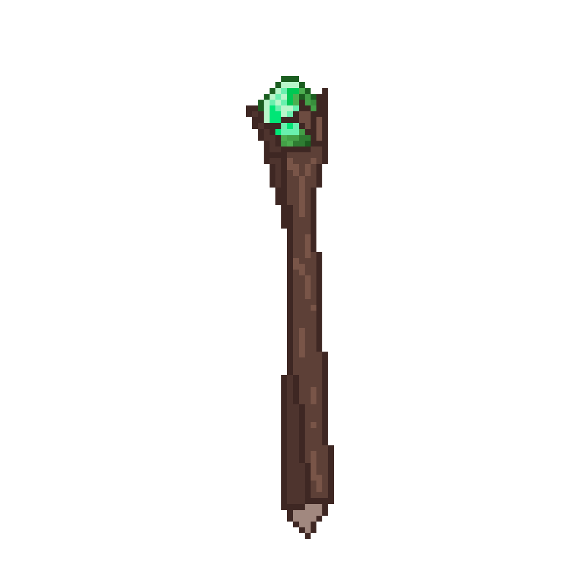
		
<h4>Tentáculo de Kraken</h4>
		
<p><strong>Descrição: É um tentáculo retirado do próprio Kraken, reis dos mares. Embora já arrancado do corpo, o tentáculo de kraken se move inconsientemente, alguns dizem que ele esta indo em busca das maresias de Corxa. Um fato importante é que o seu único portador possível é aquele que arrancou o tentáculo de kraken, o cajado irá negar todos aqueles que forem indignos.</strong> </p>
		
<p><strong>Status:</strong></p>
		
```
ATAQUE: 110 de dano
DEFESA: 30
ELEMENTO: ÁGUA
ULTIMATE: Envolver a Presa: O tenáculo incha e vai em direção ao alvo, agarrando-o e o estrangulando, causando muito dano. //// 210 de dano AGUA / 10% de chance de agarrar o alvo e dar 50 de dano por rodada
```
		

		
<h4>Cajado de Nébula</h4>
		
<p><strong>Descrição: Quase não há registro sobre esse cajado. Muito ainda acreditam que ele nem se quer exista, pois não há explicações cientificas que desmistifiquem essa nébula que habita no topo de sua haste. Os clérigos de Corxa dizem que este cajado desafia todas as leis divinas.</strong> </p>
		
<p><strong>Status:</strong></p>
		
```
ATAQUE: 105 de dano
DEFESA: 27
ELEMENTO: 
ULTIMATE: Poeira Interistelar: A nébula  no topo do cajado, começa a se esvair até desaparecer, então em uma fração de segundo, toda a poeira se concentra em um ponto minúsculo da máteria e distorce o espaço tempo do local, causando severos danos a todos em sua volta. //// 250 de dano MÁGICO (125 ao portador) / Caso alvo ainda esteja vivo, fica imóvel por uma rodada e causa 1/4 de dano a menos.
```
		

		
<h4>Chama do Inferno</h4>
		
<p><strong>Descrição: É a pura cristalização e a condesação do fogo. Esse cajado exibe o seu fogo infinito capaz de derreter os mais resistentes metais. Ele aprisiona as almas dos seus portadores, sendo talvez o úncio cajado de fogo existente no inteiro mundo de Corxa.</strong> </p>
		
<p><strong>Status:</strong></p>
		
```
ATAQUE: 140 de FOGO
DEFESA: 35
ELEMENTO: FOGO
ULTIMATE: Braseiro do Diabo: Todas as almas presentes no cajado começam a clamar por ajuda, deixando o cajado cada vez mais quente e podereso, a ponto de se tornar fogo puro queimando todos aqueles que o tocam. //// 210 de dano de FOGO / Deixa o portador e o alvo queimando - 50 de dano por rodada (metado recebida pelo portador)
```
		
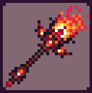
		
<h4>Crânio de Uthrul</h4>
		
<p><strong>Descrição: Cabeça arrancada do mítico monstro Uthrul. O ferreiro imbuiu as escamas e o ossos na haste e cravejou a cabeça em cima. Essa para muitos, é a arma mais forte do reino e muitos pagariam muito caro por ela.</strong> </p>
		
<p><strong>Status:</strong></p>
		
```
ATAQUE: 200 de FÍSICO
DEFESA: 40
ELEMENTO: FOGO
ULTIMATE: Metralhadora de fogo Dracônico: A boca de Uthrul começa a disparar bolas de fogo flamejantes\s. /// 250 de FOGO / 50% de deixar o alvo queimando
```
		

              
<h3><strong>Itens Passivos:</strong></h3>
		
<p>Estes itens serão todos iguais, e a única coisa que irá variar entre eles será os seus atributos. Cada item dará um atributo diferente
	
<h3>Aljava:</h3>

```
*Aljava Simples: Pega logo no início do jogo, ela tem a capacidade de 20 flechas e aumenta a chance de Crítico em +2%
```

		
```
*Aljava de Couro: Utilizada principalmente por caçadores, a aljava de couro é feita de pele animal capturada por caçadores já experientes. //// 35 flechas e aumenta a chance de crítico em +3%
```

		
```
*Aljava de Ferro: Produzido nas forjas, essa aljava é utilizada pelo principais arqueiro do reino, sendo extremamente versátil e poderosa, a aljava de ferro é restrita e bastante cara para comprar pronta. //// 50 flechas / aumenta a chance de crítico em +5%
```

		
```
*Aljava de Diamante: Produzido nas melhores forjas de Corxa, essa aljava é extremamente poderosa e muito valiosa, isso por causa da pedra de amin cravejada na base de diamante. //// 85 flechas / aumenta passivamente a defesa em +10 / aumenta a chance de crítico em +8%
```

	
```
*Aljava Real: Aljava utilizada pela elite real de Kurl, todos os atiradores de elite tem acesso a esse artefato e todos eles são muito experientes e muito bem pagos. //// 100 flechas / aumenta passivamente o crítico em +0.3x / aumenta a chance de crítico em +8%
```


```
*Aljava Draconica: A melhor aljava já feita em corxa. Produzida pelas escamas de Utrhul e costurada com linhas de sangue das artérias do próprio dragão mítico. //// 150 flechas / aumenta passivamente o critico em +0.7x / aumenta a chance de crítico em +15%
```


<h3>Flechas:</h3>
		
````
*Flecha de Pedra: Flecha mais comum e básica dos Caçadores. //// +10 de dano Físico
````

		
````
*Flecha de Tungstênio: Flecha para arqueiro já avançados, sendo bastente perfurantes pela ponta de tungstênio. //// -15 da defesa do inimigo.
````

		
````
*Flecha de Ouro: Flecha vendida pelo comerciante, principalmente utilizada para conseguir mais moedas. //// dropa mais 1.5x moedas
````

		
````
*Flecha de Forja: Flecha forjada principalmente para causar mais dano as presas. //// +30 de dano físico e aumenta +0.5x
````


````
*Flecha Elétrica: Flecha inteiramente feita de raio, formigando a e eletrizando o pordador, sendo extremamente letal para os seres atingidos por elas. //// +5% de chance de crítico / causa dano de FOGO (10% de deixar o alvo queimado 50 de dano por rodada)
````

		
````
*Flecha Draconiana: Flecha feite de ossos de dragão, sendo considerada a flecha mais forte do reino de Corxa, sendo extremamnte letal, igual um dragão na caça. //// +8% de chance de crítico aumenta +0.5xo crítico.
````


<h3>Anéis:</h3>
		
```
* Nível 1: + 10 de vida 
* Nível 2: + 20 de vida 
* Nível 3: + 30 de vida 
* Nível 4: + 40 de vida 		
* Nível 5: + 50 de vida 
* Nível Mestre: + 80 de vida 
```
		
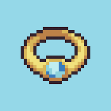
		
<h3>Colares:</h3>

```
* Nível 1: + 20 de mana 
* Nível 2: + 30 de mana 
* Nível 3: + 50 de mana 
* Nível 4: + 60 de mana 		
* Nível 5: + 80 de mana 
* Nível Mestre: + 100 de mana
```
		
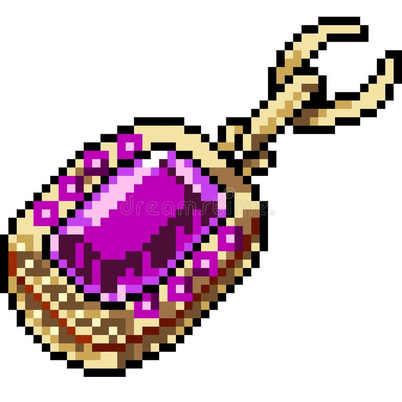

<h4>Luvas:</h4>
	
```
* Nível 1: + 30 de stamina 
* Nível 2: + 50 de stamina 
* Nível 3: + 70 de stamina 
* Nível 4: + 80 de stamina 		
* Nível 5: + 90 de stamina 
* Nível Mestre: + 120 de stamina 
```
		
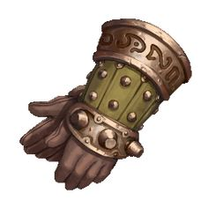
		
<h3><strong> DROPS</strong></h3>
		
<h4>DROPS pelo Mundo</h4>
		
1.	Moedas ( Baús, Inimigos, Chefões ) 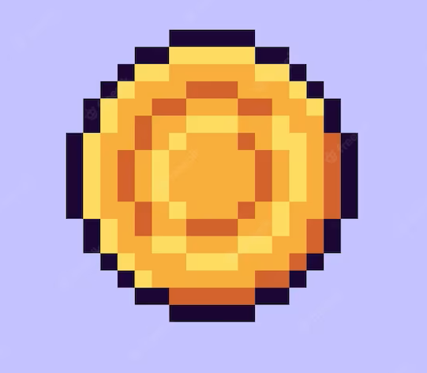
2.	Ferro ( Minério de ferro ) – Muito Comum 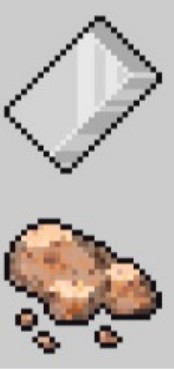
3.	Cobre ( Minério de Cobre ) – Comum 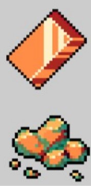
4.	Tungstênio ( Minério de Tungstênio ) – Raro 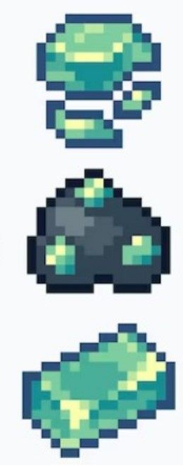
5.	Diamante ( Minério de Diamante ) – Muito Raro 
6.	Platina ( Minério de Platina ) – Muito Raro 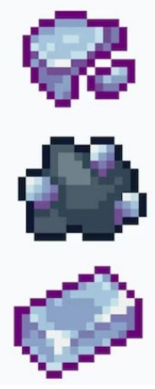
		
<h4>DROPS de inimgos</h4>
		
7.	Capacete de minerador ( Anões ) – 5%
8.	Restos de minérios ( Anões ) – 30%
9.	Pedra ( Anões ) – 60%
10.	Espada do Rei ( Rei Anão ) – 10%
11.	Tentáculo elétrico ( Água morta ) – 80%
12.	Cabeça de Água Morta ( Água Morta ) – 10%
13.	Tinta de polvo ( Kraken ) – 100%
14.	Cajado Tentáculo de Kraken ( Kraken ) – 10%
15.	Amin ( Golem de Amin ) – 20%
16.	Saphira ( Anões, Rei Anão, Golem de Amin ) – 20%
17.	Rubi ( Anões, Rei Anão ) – 20%
18.	Perna de aranha ( Aranha ) – 80%
19.	Presa de aranha ( Aranha ) – 10%
20.	Perna de aranha Poderosa ( Aranha Rainha ) – 80% 
21.	Presa de aranha Poderosa ( Aranha Rainha ) – 30%
22.	Úmero de esqueleto ( Esqueleto ) – 80%
23.	Hioide de esqueleto ( Esqueleto ) – 30%
24.	Fêmur de esqueleto ( Esqueleto ) – 3%
25.	Geleia gosmenta ( Slime ) – 100%
26.	Madeira ( Árvore ) – 100%
27.	Galho de árvore ( Árvore ) – 40% 
28.	Geleia Resistente ( Slime Ogro ) – 100%
29.	Geleia Poderosa ( Slime Ogro ) – 20%
